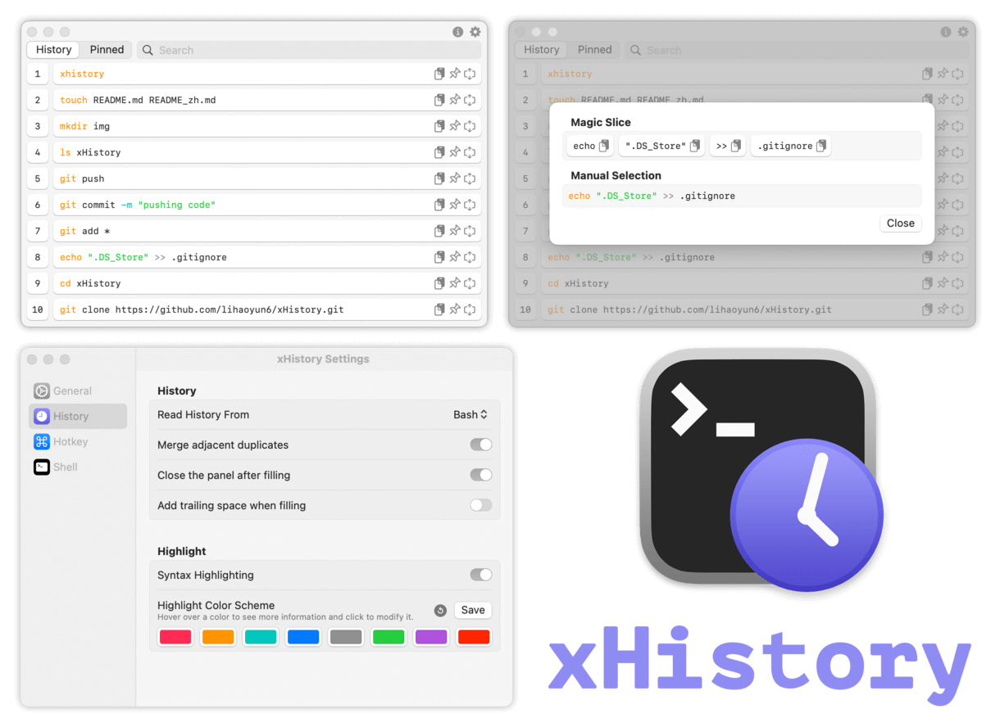

# 
<p align="center">

<h1 align="center">xHistory</h1>
<h3 align="center">一款功能强大的终端历史记录管理工具<br><a href="./README.md">[English Version]</a></h3> 
</p>

## 运行截图
<p align="center">
<picture>
  <source media="(prefers-color-scheme: dark)" srcset="./img/preview_zh_dark.png">
  <source media="(prefers-color-scheme: light)" srcset="./img/preview_zh.png">
  
</picture>
</p>

## 安装与使用
### 系统版本要求:
- macOS 12.0 及更高版本  

### 安装:
可[点此前往](../../releases/latest)下载最新版安装文件. 或使用homebrew安装:  

```bash
brew install lihaoyun6/tap/xhistory
```

### 使用:
- xHistory 使用简单, 无需手动配置终端选项即可自动读取多种 shell 的历史记录.  

- 启动后默认显示在菜单栏中(可以隐藏), 也可通过快捷键或命令行来快速打开面板. 
- 支持搜索命令, 语法高亮, 自动填充, 智能切片, 命令收藏, 屏蔽特定命令等功能. 

## 常见问题
**1. 为什么执行命令后没有出现在历史记录面板中?**  
> 首次安装并启动 xHistory 后, 您需要登录到新的 shell 会话才行.  

**2. 为什么 xHistory 需要申请辅助功能权限?**  
> 因为 xHistory 的 "自动填充" 功能会模拟键盘输入, 必须要有辅助功能权限才能正常工作.   

## 赞助


## 致谢
[KeyboardShortcuts](https://github.com/sindresorhus/KeyboardShortcuts) @sindresorhus  
[SFSMonitor](https://github.com/ClassicalDude/SFSMonitor) @ClassicalDude  
[SwiftTreeSitter](https://github.com/ChimeHQ/SwiftTreeSitter) @ChimeHQ  
[tree-sitter-bash](https://github.com/tree-sitter/tree-sitter-bash) @tree-sitter  
[ChatGPT](https://chat.openai.com) @OpenAI  
